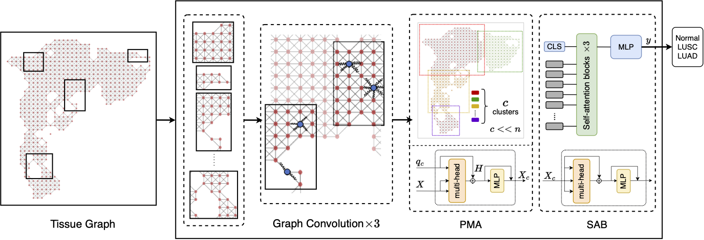

# Graph perceiver network for lung tumor and premalignant lesion stratification from histopathology
<details>
<summary>
  <b>This work is published in the</b>
  <a href="https://doi.org/10.1016/j.ajpath.2024.03.009" target="blank">[American Journal of Pathology]</a>
</summary>

```bash
@article {Gindra2023.10.16.562550,
	author = {Rushin H. Gindra and Yi Zheng and Emily J. Green and Mary E. Reid and Sarah A. Mazzilli and Daniel T. Merrick and Eric J. Burks and Vijaya B. Kolachalama and Jennifer E. Beane},
	title = {Graph perceiver network for lung tumor and premalignant lesion stratification from histopathology},
	elocation-id = {2023.10.16.562550},
	year = {2023},
	doi = {10.1101/2023.10.16.562550},
	publisher = {Cold Spring Harbor Laboratory},
	URL = {https://www.biorxiv.org/content/early/2023/10/19/2023.10.16.562550},
	eprint = {https://www.biorxiv.org/content/early/2023/10/19/2023.10.16.562550.full.pdf},
	journal = {bioRxiv}
}
```
</details>

<div align="center">
  
</div>

<details>
  <summary>
	  <b>Key Ideas & Main Findings</b>
  </summary>

We hypothesize that computational methods can help capture tissue heterogeneity in histology whole slide images (WSIs) and stratify PMLs by histologic severity or their ability to progress to invasive carcinoma, providing an informative pipeline for assessment of premalignant lesions. Graph Perceiver Networks is a generalized architecture that integrates the graph module with the perceiver architecture, enabling sparse graph computations on visual tokens and computationally efficient modeling of the perceiver. The architecture reduces the computational footprint significantly compared to state-of-the-art WSI analysis architectures, thus allowing for extremely large WSIs to be processed efficiently. 

As a bonus, the architecture is explainable and can be trained on large batch-sizes without the extreme computational head, thus making it a suitable candidate for further academic research lab centric projects. 
Based on Pytorch and Pytorch-Geometric. 
</details>

## Table of Contents
- [Pre-requisites and Installations](#pre-requisites-and-installations)
- [Data Download and Preprocessing](#data-download-and-preprocessing)
- [Data Tree Structure](#data-tree-structure)
- [Pretrained Model Weights and Training Instructions](#pretrained-model-weights-and-training-instructions)
- [Evaluation and Testing](#evaluation-and-testing)
- [Explanatory Heatmaps](#explanatory-heatmaps)
- [Contact for Issues](#contact-for-issues)
- [Acknowledgements, License, and Usage](#acknowledgements-license-and-usage)


## Updates / TODOs
Please follow this GitHub for more updates.
- [] Remove dead code in Repository
- [] Pre-requisites and installations (Conda env & docker container)
- [] Add data downlaod + preprocessing steps (python file)
- [] Also add data tree structure (For easy understanding)
- [] Add pretrained model weights + instructions for training & evaluation (python files)
- [] Add code for K-NN evaluation (jupyter notebook)
- [] Add code for visualization (jupyter notebook)
- [] Explanatory Heatmaps
- [x] Contact for Issues
- [x] Acknowledgements, License & Usage


## Pre-requisites and Installations

Conda installation and Potentially a docker container at some point.

## Data Download and Preprocessing
### Data Download
**Resections**
- **TCGA-[LUAD|LUSC]**: To download Tissue Slides WSIs (formatted as .svs files) and associated clinical metadata, please refer to the [NIH Genomic Data Commons Data Portal](https://portal.gdc.cancer.gov/). WSIs for each cancer type can be downloaded using the [GDC Data Transfer Tool](https://docs.gdc.cancer.gov/Data_Transfer_Tool/Users_Guide/Data_Download_and_Upload/).
- **CPTAC-[LUAD|LSCC]**: To download the WSIs (formatted as .svs files) from the discovery cohort, and the associated clinical metaata, please refer to the [The Cancer Imaging Archive Portal](https://www.cancerimagingarchive.net/browse-collections/). WSIs from CPTAC can be downloaded using [TCIA_Utils](https://github.com/kirbyju/tcia_utils)

**Biopsies**
- **UCL**: Lung biopsy samples from University College London. To download the biopsy WSIs (formatted as .ndpi) and associated clinical metadata, please refer to the [Imaging Data Resources repository](https://idr.openmicroscopy.org/about/index.html), IDR 0082. WSIs from repository can be downloaded using [Aspera protocol](https://idr.openmicroscopy.org/about/download.html)
- **Roswell**: Lung biopsy samples from Roswell park comprehensive cancer institute.

<details>
<summary>
<b>Example Directory</b>
</summary>
  
```bash
└──TCGA_ROOT_DIR/
	└──	TCGA_train.txt
	└──	TCGA_test.txt
	└──	TCGA_plot.txt
	└── WSIs/
		├── slide_1.svs
		├── slide_2.svs
		└── ...
	└── ctranspath_pt_features/
		└── slide_1/
			├── adj_s_ei.pt
			├── adj_s.pt
			├── c_idx.txt
			├── edge_attr.pt
			└── features.pt
		└── slide_2/
		└── ...		
	└── patches256
		└── slide_1/
			├── 20.0
				├── x_y.png
				└── ...
		└── slide_2
		└── ...
└──CPTAC_ROOT_DIR/
	└──	CPTAC_test.txt
	└──	CPTAC_plot.txt
	└── WSIs/
	└── ctranspath_pt_features/
	└── patches256
└── ...
```
</details>
Each data cohort is organized as its own folder in [TCGA|CPTAC|UCL|Roswell]_ROOT_DIR.

For preprocessing (patching, feature extraction and graph construction), see [preprocessing/graph_construction.py](https://github.com/rushin682/TNTA/blob/main/graph_builder/build_graphs.py) 

You can train your model on a multi-centric dataset with the following k-fold cross validation (k=5) scheme where `--` (train) `**` (val), and `##` (test).
```
[--|--|--|**|##]
[--|--|**|##|--]
[--|**|##|--|--]
[**|##|--|--|--]
[##|--|--|--|**]
```
## Pretrained Model Weights and Training Instructions
Models were trained for 30 epochs with a batch size of 8 using 5-fold cross-validation. These models were evaluated using an internal TCGA test set per fold and the CPTAC external test set. 

GPU Hardware used for training: Nvidia GeForce RTX 2080ti - 11GB.

**Note**: Ideally, longer training with larger batch sizes would demonstrate larger gains in the models performance.

- Links to download pretrained model weights.

<table>
  <tr>
    <th>Arch</th>
    <th>SSL Method</th>
    <th>Dataset</th>
    <th>Epochs</th>
    <th>Cross-Attn-Nodes</th>
    <th>Performance(Acc)</th>
    <th>Download</th>
  </tr>
  
  <tr>
    <td>Graph Perceiver Network</td>
    <td>CTransPath</td>
    <td>TCGA</td>
    <td>30</td>
    <td>200</td>
    <td>N/A</td>
    <td>N/A</td>
  </tr>
  
  <tr>
    <td>Graph Perceiver Network</td>
    <td><a href="https://github.com/vkola-lab/tmi2022">SimCLR-Lung</a></td>
    <td>NLST-TMA</td>
    <td>30</td>
    <td>200</td>
    <td>N/A</td>
    <td>N/A</td>
  </tr>
</table>


- Instructions for training and evaluating the models (include python files).

## Evaluation and Testing
- TCGA (internal test set)
- CPTAC (external test set)
- K-NN evaluation: Description of the K-NN evaluation process. Link or embedded Jupyter notebook for K-NN evaluation

## Explanatory Heatmaps
- Details about the visualization techniques used.
- Link or embedded Jupyter notebook for visualization.

## Contact for Issues
- Please open new threads or report issues directly (for urgent blockers) to rushin.gindra@helmholtz-munich.de
Immediate response to minor issues may not be available.
	
## Acknowledgements, License, and Usage
- Credits and acknowledgements.
- License information.
- Usage guidelines and restrictions.

